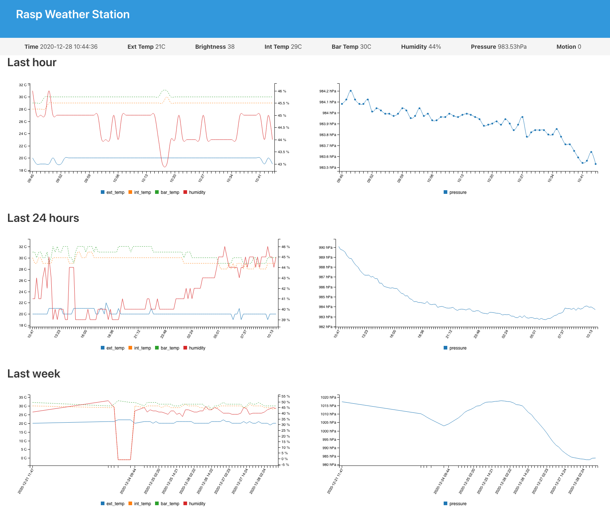

# Pi Weather Station

A simple Raspberry Pi weather station project. It uses the
[DockerPi Sensor Hub Development Board](https://wiki.52pi.com/index.php/DockerPi_Sensor_Hub_Development_Board_SKU:_EP-0106) and currently runs on a Raspberry Pi 3 B+.
Data is stored in a sqlite database.

## Pi setup

- Install Raspbian
- Update the ansible inventory
- Run the ansible playbooks:
    + `ansible-playbook setup-pi.yml`
    + `ansible-playbook setup-app.yml`

